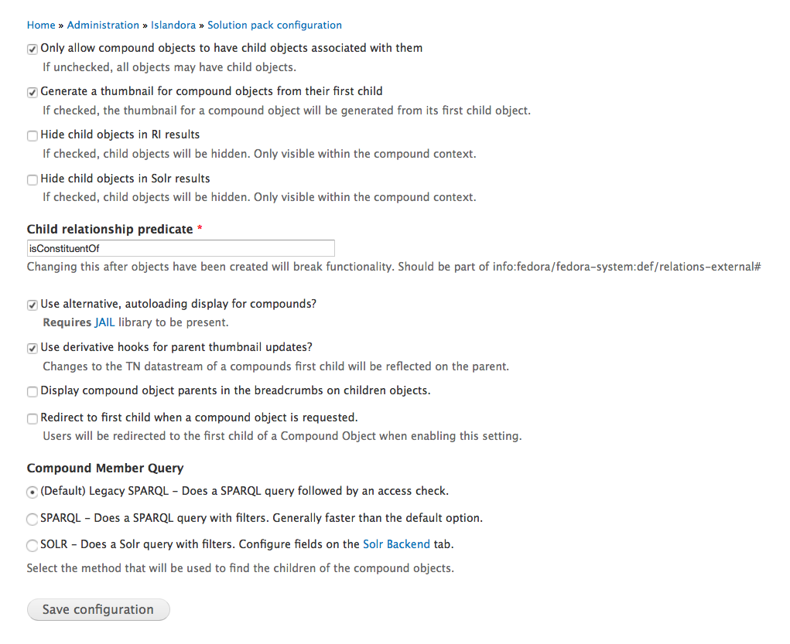

# Compound Object Solution Pack 

## Introduction

The Islandora Compound Object Solution Pack enables generic parent-child relationships between objects. The object view of a compound object is replaced by the view of its first child object. The included "Islandora Compound Object Navigation" block provides a thumbnail navigation of an object's siblings. A "Compound" management tab allows for the addition and removal of parent and child objects for each object.

## Requirements

This module requires the following modules/libraries:

* [Islandora](https://github.com/islandora/islandora)

This module has also the following optional requirements for certain features:

For Solr Search Integration, which allows the actual use of the 'Solr filter query' option and enables an aditional Solr Driven 'Compound Member Query' option:

* [Islandora Solr Search](https://github.com/Islandora/islandora_solr_search) Module

For Islandora Compound Object JAIL Display:

* [JAIL](https://github.com/sebarmeli/JAIL) JQuery library 

## Installation

Install as usual, see [this](https://drupal.org/documentation/install/modules-themes/modules-7) for further information.

If utilizing the lazy loading image ability of the solution pack, the [JAIL](https://github.com/sebarmeli/JAIL) JQuery
library must be present within sites/all/libraries/JAIL.

## Configuration

Set the 'Child relationship predicate' and 'Solr filter query', as well as display options in search results and derivative creation options in Administration » Islandora » Solution pack configuration » Compound Object Solution Pack (admin/islandora/solution_pack_config/compound_object).

The 'Redirect to first child when a compound object is requested' option skips the Islandora generated parent object display by redirecting, via HTTP, to the first visible child of a compound ensemble.

Optionally, enable the JAIL compound block to utilize the lazy loading image
ability using Javascript by checking 'Use alternative, alternative dsiplay for compounds' as shown below.

### Solr Integration

If the Solr Search Module is enabled, and additional Compound Member Query Option and a new 'Solr Backend' Menu tab will be activated at Administration » Islandora » Solution Pack Configuration » Compound Object Solution Pack (admin/islandora/solution_pack_config/compound_object/solr)

**Block**:

There exist two block options for displaying compound objects within Islandora.
The default "Islandora Compound Object Navigation" block will provide navigation
controls and loading of all objects related to the parent compound. The latter
option is a block utilizing the [JAIL](https://github.com/sebarmeli/JAIL)
library which allows for lazy loading of images. This allows the block to load
images only when they are being accessed which will greatly increase performance
on compounds with many children.

**Theme**:

The "Islandora Compound Object Navigation" block can be themed. See `theme_islandora_compound_prev_next()`.

**Drush**:

A Drush command has been added, to be run from the command line (Terminal), that will update the existing rel-predicate of existing compound objects to `isConstituentOf`. It can be run with the drush command `drush update_rels_predicate`. This command accpets no arguments.

## Documentation

Further documentation for this module is available at [our wiki](https://wiki.duraspace.org/display/ISLANDORA/Compound+Solution+Pack).

## Troubleshooting/Issues

Having problems or solved a problem? Check out the Islandora google groups for a solution.

* [Islandora Group](https://groups.google.com/forum/?hl=en&fromgroups#!forum/islandora)
* [Islandora Dev Group](https://groups.google.com/forum/?hl=en&fromgroups#!forum/islandora-dev)

## Maintainers/Sponsors
Current maintainers:

* [Diego Pino](https://github.com/diegopino)

## Development

If you would like to contribute to this module, please check out [CONTRIBUTING.md](CONTRIBUTING.md). In addition, we have helpful [Documentation for Developers](https://github.com/Islandora/islandora/wiki#wiki-documentation-for-developers) info, as well as our [Developers](http://islandora.ca/developers) section on the [Islandora.ca](http://islandora.ca) site.

## License

[GPLv3](http://www.gnu.org/licenses/gpl-3.0.txt)
